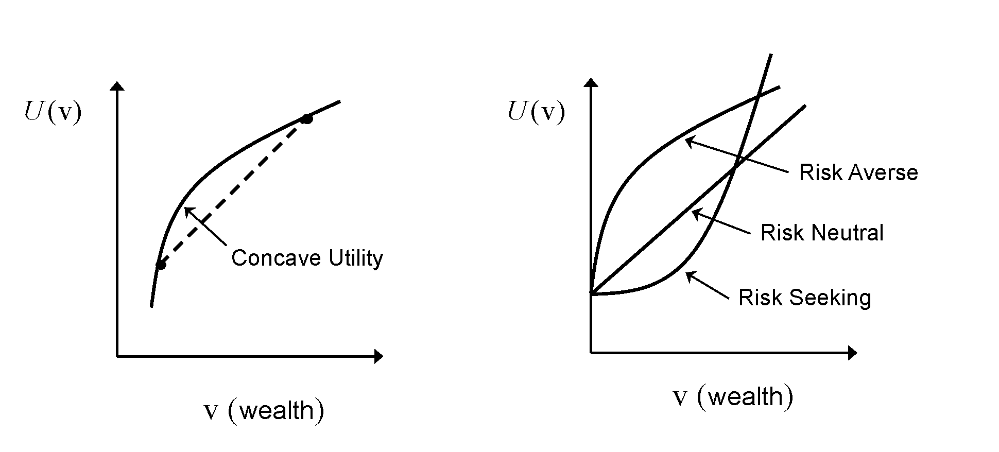

::: {.callout-important appearance="minimal"}
**Copyright Notice.** Planned for publication in 2026 by R. Douglas Martin, Thomas K. Philips, Bernd Scherer, and Kirk Li. All rights reserved. © Copyright 2025.
:::

::: {.callout-note appearance="minimal"}
[Download Appendix C PDF](pdfs/appendix-c.pdf){target="_blank" .btn .btn-outline-primary} &nbsp;&nbsp; The complete PDF is embedded below and available for download.
:::

```{=html}
<iframe src="pdfs/appendix-c.pdf" width="100%" height="950px" style="border: 1px solid #dee2e6; border-radius: 4px;"></iframe>
```

## C.1 Investor Preferences and Utility Functions

The question of how to choose among investment opportunities has a rich history, with interdisciplinary contributions by gamblers, economists, mathematicians and psychologists. Early on, it was broadly accepted that the fair price of entry to a game of chance was the expected value of its payoff. But in 1710, Nicolaus Bernoulli described the **St. Petersburg game**, which threw this belief into doubt.

A fair coin is repeatedly flipped, and the number of flips till the first head, denoted $k$, is noted. The gambler is paid $\$2^{k}$ for participating. As the probability of first seeing a head on the $k^{th}$ flip is $\tfrac{1}{2^{k}}$, the expected payoff is

$$
\begin{align}
E\left[\mathrm{Payoff}\right] &= \sum_{k\,\geqslant\,1}\frac{1}{2^{k}}\cdot\$2^{k} = \infty.
\end{align}
$$

But no gambler would pay an infinite amount to participate. In practice, gamblers seem willing to pay no more than about $20 — a paradox. Daniel Bernoulli resolved it by positing that gamblers have logarithmic utility for wealth. The expected utility is

$$
\begin{align}
E\left[\ln\left(\mathrm{Payoff}\right)\right] &= \sum_{k\,\geqslant\,1}\frac{1}{2^{k}}\cdot\ln\left(2^{k}\right) = \sum_{k\,\geqslant\,1}\frac{k}{2^{k}}\cdot\ln\left(2\right) = 2\ln\left(2\right),
\end{align}
$$

which is finite.

Moscati (2019) traces the evolution of resolutions to this paradox, culminating in the axiomatic theory of utility by von Neumann and Morgenstern (VNM) in 1947. The VNM axioms are expressed in terms of preferences over random outcomes (or "lotteries"). We write $X\succ Y$ for a strong preference for lottery $X$ over $Y$, $X\sim Y$ for indifference, and $X\succeq Y$ for weak preference. By definition,

$$
X\succeq Y \equiv X\succ Y\ \mathrm{or}\ X\sim Y.
$$

**Axiom 1 (Completeness):** For any pair of lotteries $X$ and $Y$, either $X\succ Y$, or $Y\succ X$, or $X\sim Y$.

**Axiom 2 (Transitivity):** For any three lotteries $X,\ Y,\ Z$: if $X\succeq Y$ and $Y\succeq Z$, then $X\succeq Z$.

**Axiom 3 (Substitution):** For any three lotteries $X,\ Y,\ Z$: if $X\succeq Y\succeq Z$, then $Y\sim p\,X+(1-p)\,Z$ for some $p\in[0,1]$.

Von Neumann and Morgenstern (1947) proved that if investors' preferences satisfy these three axioms, they choose among risky alternatives so as to maximize their expected utility. *Expected Utility Maximization* (EUM) has come to be the dominant paradigm for modeling choice in economics (see also Levy, 2016).

EUM requires investors to express preferences via a *cardinal utility function* $U(\mathrm{v})$ — a dimensionless function of end-of-period wealth $\mathrm{v}$, invariant under an affine transformation $\check{U}(\mathrm{v})=a+b\cdot U(\mathrm{v}),\ b>0$.

The form of the utility function $U$ depends on assumptions about investor preferences. Two simple and reasonable assumptions are:

**P1: Non-satiation.** At any level of wealth $\mathrm{v}_{1}$, the investor prefers a strictly larger wealth $\mathrm{v}_{2}>\mathrm{v}_{1}$.

**P2: Risk Aversion.** The investor is *risk averse*: she always prefers a fixed end-of-period wealth $\mathrm{v}_{0}$ to a *fair game* in which end-of-period wealth is the random amount $\mathrm{V}=\mathrm{v}_{0}+\mathrm{H}$, where $\mathrm{H}$ has mean zero and variance $\sigma^{2}>0$.

An investor with preferences P1 and P2 uses a utility function with:

**U1.** $U(\mathrm{v})$ is strictly increasing in $\mathrm{v}$, and

**U2.** $U(\mathrm{v})$ is strictly concave.

For utility functions with first and second derivatives, these properties are equivalent to $U^{\prime}(\mathrm{v})>0$ and $U^{\prime\prime}(\mathrm{v})<0$. The first derivative of $U$ is known as its *marginal utility*.

{fig-alt="Concave and convex utility function shapes"}

---

## C.2 Concave Utility Functions and Risk Aversion

Consider the fair investment game with end-of-period wealth $\mathrm{V}=\mathrm{v}_{0}+\mathrm{H}$, where

$$
\mathrm{H}=\begin{cases}
\mathrm{h}_{1}:\ -\mathrm{v}_{0}<\mathrm{h}_{1}<0, & \text{with probability } p\\
\mathrm{h}_{2}:\ 0<\mathrm{h}_{2}, & \text{with probability } 1-p
\end{cases}
$$

with $E\left[\mathrm{H}\right]=p\,\mathrm{h}_{1}+(1-p)\,\mathrm{h}_{2}=0$, so $E\left[\mathrm{V}\right]=\mathrm{v}_{0}$.

For this fair game:

$$
E\left[U(\mathrm{V})\right]=p\cdot U(\mathrm{v}_{0}+\mathrm{h}_{1})+(1-p)\cdot U(\mathrm{v}_{0}+\mathrm{h}_{2}),
$$

and since $U(\mathrm{v}_{0})=E\left[U(\mathrm{v}_{0})\right]$:

$$
E\left[U(\mathrm{v}_{0})\right]=U\left(p\cdot(\mathrm{v}_{0}+\mathrm{h}_{1})+(1-p)\cdot(\mathrm{v}_{0}+\mathrm{h}_{2})\right).
$$

Since by P2 the EUM investor is risk averse, she prefers the sure outcome $\mathrm{v}_{0}$ to the risky outcome $\mathrm{V}$, so $E\left[U(\mathrm{v}_{0})\right]>E\left[U(\mathrm{V})\right]$, which gives

$$
U\left(p\cdot\mathrm{v}_{1}+(1-p)\cdot\mathrm{v}_{2}\right)>p\cdot U(\mathrm{v}_{1})+(1-p)\cdot U(\mathrm{v}_{2}),\ \forall\,\mathrm{v}_{1}<\mathrm{v}_{2}.
$$

This is precisely the statement that $U$ is a strictly concave function.

---

## C.3 Certainty Equivalent Value and the Risk Premium

The *Certainty Equivalent Value* $\mathrm{v}_{c}$ satisfies:

$$
\begin{align}
U(\mathrm{v}_{c}) &= E[U(\mathrm{V})] \\
&\implies \mathrm{v}_{c} = U^{-1}\left(E[U(\mathrm{V})]\right).
\end{align}
$$

We interpret $\mathrm{v}_{c}$ as the lower, sure value that a risk-averse investor would accept in place of the risky payoff $\mathrm{V}$.

![Certainty Equivalent Value: graphical illustration for a risk-averse investor. The certainty equivalent $v_c$ is strictly less than the expected wealth $E[V]$.](3C__Users_tkpme_Dropbox_BookPCRA_Springer_Produ____C_Utility_Theory_Plots_certaintyEquivalent.png){fig-alt="Certainty equivalent value for expected utility"}

Note that $\mathrm{v}_{c}<E[\mathrm{V}]$, because Jensen's inequality for a strictly concave function asserts that $E\left[U(\mathrm{V})\right]<U\left(E\left[\mathrm{V}\right]\right)$. Thus

$$
U(\mathrm{v}_{c})=E\left[U(\mathrm{V})\right]<U\left(E\left[\mathrm{V}\right]\right),
$$

and since $U$ is strictly increasing, $\mathrm{v}_{c}<E[\mathrm{V}]$.

The *Absolute Risk Premium* is

$$
\pi_{A}\left(E[\mathrm{V}]\right)=E[\mathrm{V}]-\mathrm{v}_{c}.
$$

It can be interpreted as the amount of wealth the investor is willing to forego to avoid the risk of a fair investment game. The *Relative Risk Premium* is the fraction of wealth she would pay:

$$
\begin{align}
\pi_{R}\left(E[\mathrm{V}]\right) &= \frac{\pi_{A}\left(E[\mathrm{V}]\right)}{E[\mathrm{V}]} = \frac{E[\mathrm{V}]-\mathrm{v}_{c}}{E[\mathrm{V}]}.
\end{align}
$$

---

## C.4 Absolute and Relative Risk Aversion

The risk premium is a function of both how uncertain an investment is and the shape of the utility curve. Let $\mathrm{v}_{0}$ be an initial level of wealth, $\mathrm{V}=\mathrm{v}_{0}+\mathrm{H}$ with $E[\mathrm{H}]=0$, variance $\sigma_{H}^{2}$, and let $\mathrm{v}_{c}$ be the certainty equivalent.

Expanding $U(\mathrm{V})$ in a two-term Taylor series around its mean:

$$
U(\mathrm{V}) \approx U(\mathrm{v}_{0}) + U^{\prime}(\mathrm{v}_{0})(\mathrm{V}-\mathrm{v}_{0}) + \frac{1}{2}\cdot U^{\prime\prime}(\mathrm{v}_{0})(\mathrm{V}-\mathrm{v}_{0})^{2},
$$

and expanding $U(\mathrm{v}_{c})$ in a one-term Taylor series:

$$
U(\mathrm{v}_{c}) \approx U(\mathrm{v}_{0}) + U^{\prime}(\mathrm{v}_{0})(\mathrm{v}_{c}-\mathrm{v}_{0}).
$$

Taking expectations of the first and equating with the second:

$$
\begin{align}
\pi_{A}(\mathrm{v}_{0}) &\triangleq \mathrm{v}_{0}-\mathrm{v}_{c} = -\frac{1}{2}\cdot\frac{U^{\prime\prime}(\mathrm{v}_{0})}{U^{\prime}(\mathrm{v}_{0})}\cdot\sigma_{H}^{2} = \frac{1}{2}\cdot ARA(\mathrm{v}_{0})\cdot\sigma_{H}^{2},
\end{align}
$$

where **Absolute Risk Aversion** (ARA) is defined as

$$
ARA(\mathrm{v})=-\frac{U^{\prime\prime}(\mathrm{v})}{U^{\prime}(\mathrm{v})}.
$$

Similarly, **Relative Risk Aversion** (RRA) is:

$$
\begin{align}
RRA(\mathrm{v}) &= \mathrm{v}\cdot ARA(\mathrm{v}) = -\frac{\mathrm{v}\cdot U^{\prime\prime}(\mathrm{v})}{U^{\prime}(\mathrm{v})}.
\end{align}
$$

A constant relative risk aversion (CRRA) investor must exhibit decreasing ARA. Empirical evidence suggests that most investors exhibit decreasing absolute risk aversion. It is common practice to assume investors exhibit Constant Relative Risk Aversion (Bellante and Green, 2004; Halek and Eisenhauer, 2001).

---

### Marginal Utility and Risk Aversion of Common Utility Functions {.unnumbered}

**Logarithmic (Log) Utility**

$$
U(\mathrm{v})=\ln(\mathrm{v}),\quad \mathrm{v}>0.
$$

With $U^{\prime}(\mathrm{v})=1/\mathrm{v}$ and $U^{\prime\prime}(\mathrm{v})=-1/\mathrm{v}^{2}$:

$$
ARA(\mathrm{v}) = \frac{1}{\mathrm{v}},\qquad RRA(\mathrm{v}) = 1.
$$

The marginal utility $U^{\prime}(\mathrm{v})=1/\mathrm{v}$, just as Daniel Bernoulli posited. Logarithmic utility is closely related to the geometric mean (see Section C.8).

---

**Generalized Logarithmic (GLUM) Utility**

Introduced by Rubinstein (1976, 1977) as a flexible alternative to the CAPM:

$$
U(\mathrm{v})=\ln(\mathrm{v}+A),\quad \mathrm{v}>-A.
$$

With $U^{\prime}(\mathrm{v})=1/(\mathrm{v}+A)$ and $U^{\prime\prime}(\mathrm{v})=-1/(\mathrm{v}+A)^{2}$:

$$
ARA(\mathrm{v}) = \frac{1}{\mathrm{v}+A},\qquad RRA(\mathrm{v}) = \frac{\mathrm{v}}{\mathrm{v}+A}.
$$

RRA is increasing, constant, or decreasing in wealth according to whether $A$ is positive, zero, or negative. If $-A$ is interpreted as the present value of the investor's liabilities, then $\mathrm{v}+A$ is her *actuarial surplus* or *discretionary wealth*.

In terms of returns:

$$
U(r)=\frac{\ln(1+\lambda\,r)}{\lambda},\quad r>-\frac{1}{\lambda},\ \lambda>0.
$$

A two-term Taylor expansion around $r=0$ gives $U(r)\approx r - \tfrac{\lambda}{2}r^{2}$, and taking expectations:

$$
E[U(r)] \approx E[r] - \frac{\lambda}{2}\,\sigma^{2},
$$

identifying $\lambda$ as a measure of risk aversion. Wilcox, Zieff, and Satchell (2025) argue that it is effective in practice to set $\lambda=1/f_{max}$, where $f_{max}$ is the largest fraction of financial wealth the investor can lose without ruining her life. Many investors give $f_{max}$ between $\tfrac{1}{4}$ and $\tfrac{1}{2}$, corresponding to $\lambda$ between 2 and 4.

---

**Power Utility**

$$
U(\mathrm{v};\,\gamma)=\dfrac{\mathrm{v}^{1-\gamma}}{1-\gamma},\quad \mathrm{v}>0,\quad \gamma>0,\quad \gamma\neq1.
$$

$$
ARA(\mathrm{v}) = \frac{\gamma}{\mathrm{v}},\qquad RRA(\mathrm{v}) = \gamma.
$$

Marginal utility: $U^{\prime}(\mathrm{v})=\mathrm{v}^{-\gamma}$. As $\gamma\to 1$, power utility converges to logarithmic utility.

---

**Exponential Utility**

$$
U(\mathrm{v})=\frac{1-\exp(-c\cdot\mathrm{v})}{c},\quad c>0,\ \mathrm{v}\geqslant 0.
$$

Marginal utility: $\exp(-c\cdot\mathrm{v})$.

$$
ARA(\mathrm{v}) = c,\qquad RRA(\mathrm{v}) = c\mathrm{v}.
$$

Despite its analytic tractability, exponential utility's constant ARA and increasing RRA do not reflect commonly accepted views on investor risk aversion.

---

**Quadratic Utility**

$$
U(\mathrm{v}) = \mathrm{v} - c\,\mathrm{v}^{2},\quad c>0,\ \mathrm{v}>0.
$$

Marginal utility: $1-2\,c\,\mathrm{v}$.

$$
ARA(\mathrm{v}) = \frac{2\,c}{1-2\,c\,\mathrm{v}},\qquad RRA(\mathrm{v}) = \frac{2\,c\,\mathrm{v}}{1-2\,c\,\mathrm{v}}.
$$

These are infinite for $\mathrm{v}=1/(2c)$ and negative for $\mathrm{v}>1/(2c)$, making quadratic utility useless for such values. In spite of these severe limitations, it plays an important role in portfolio management because most utility functions can be approximated reasonably well by a two-term Taylor series expansion around the current level of wealth. Arrow (1971) characterized it as "absurd."

---

All five utility functions belong to the class of **H**yperbolic **A**bsolute **R**isk **A**version (HARA) utility functions, characterized by:

$$
ARA(\mathrm{v})=\frac{1}{\gamma\,\mathrm{v}+\delta}.
$$

| Utility Function | Absolute and Relative Risk Aversion |
|:---|:---|
| Logarithmic | Decreasing ARA and constant RRA |
| Generalized Logarithmic | Decreasing ARA and increasing, constant, or decreasing RRA |
| Power | Decreasing ARA and constant RRA |
| Exponential | Constant ARA and linearly increasing RRA |
| Quadratic | Increasing ARA and increasing RRA |

: Absolute and Relative Risk Aversion for Various Utility Functions

A CRRA investor would use a log or power utility function, and would not use a quadratic or exponential utility function.

---

## C.5 Expected Utility Maximization and Mean Variance Optimization

### EUM with Certain Families of Returns Distributions {.unnumbered}

If asset returns are multivariate normal, then portfolio return $r_{P}=\mathbf{w}^{\prime}\mathbf{r}$ has a normal distribution with mean $\mu_{P}=\mathbf{w}^{\prime}\boldsymbol{\mu}$ and variance $\sigma_{P}^{2}=\mathbf{w}^{\prime}\boldsymbol{\Sigma}\mathbf{w}$. In this case the expected utility will be a deterministic function of the portfolio's mean return and standard deviation that is increasing in $\mu_{P}$ and decreasing in $\sigma_{P}$, and the EUM investor holds MinVar portfolios.

For exponential utility with normally distributed returns, EUM leads to the quadratic utility form of MVO. But this relies on both the weakness of the normal returns assumption and the inappropriateness of exponential utility.

Benveniste, Kolm, and Ritter (2024) provide a more robust defence of mean-variance optimization for a class of *standard utility functions* (increasing, strictly concave, continuously differentiable). They prove that utility maximization is equivalent to mean-variance optimization for any standard utility function if and only if the security returns vector $\mathbf{r}$ admits the representation

$$
\mathbf{r}=\boldsymbol{\mu}\,Z+\boldsymbol{\varepsilon},
$$

where $\boldsymbol{\mu}$ is a vector, $Z$ is a scalar random variable with $E[Z]=1$, and $\boldsymbol{\varepsilon}$ is a random vector with $E[\boldsymbol{\varepsilon}\,|\,Z]=\mathbf{0}$ and $\mathbf{C}_{\boldsymbol{\varepsilon}}=\boldsymbol{\Sigma}-\mathrm{var}(Z)\,\boldsymbol{\mu}\,\boldsymbol{\mu}^{\prime}$.

Additionally, security returns do not follow a multivariate normal distribution: small-cap stocks and hedge fund returns are often highly non-normal, exhibiting both skewness and kurtosis. Since arithmetic returns are bounded below by $-100\%$, no standard distribution will be entirely adequate.

---

### Expected Utility Taylor Series Approximation and Quadratic Utility {.unnumbered}

A common approach assumes a CRRA utility function and uses a two-term Taylor series expansion of $U$ about $r_{P}=0$:

$$
U(\mathrm{v}_{0}\cdot(1+r_{P})) = U(\mathrm{v}_{0}) + U^{\prime}(\mathrm{v}_{0})\cdot r_{P} + \dfrac{1}{2}U^{\prime\prime}(\mathrm{v}_{0})\cdot r_{P}^{2} + HOT.
$$

Taking expectations and ignoring higher-order terms:

$$
\mathrm{E}\left[U(\mathrm{V})\right] \approx U(\mathrm{v}_{0}) + U^{\prime}(\mathrm{v}_{0})\left(\mu_{P} - \dfrac{1}{2}\,ARA_{U}(\mathrm{v}_{0})\cdot\left(\sigma_{P}^{2}+\mu_{P}^{2}\right)\right).
$$

Since $U^{\prime}(\mathrm{v}_{0})>0$, maximizing $\mathrm{E}\left[U(\mathrm{V})\right]$ is equivalent to maximizing

$$
Q_{U}(\mu_{P},\,\sigma_{P})=\mu_{P}-\dfrac{1}{2}ARA_{U}(\mathrm{v}_{0})\cdot\left(\sigma_{P}^{2}+\mu_{P}^{2}\right).
$$

When $\mu_{P}^{2}$ is negligible relative to $\sigma_{P}^{2}$, this reduces to the standard quadratic utility form of MVO.

---

## C.6 Expected Quadratic Utility and QP Optimization

Direct use of a quadratic utility function of wealth $U(\mathrm{v})=\mathrm{v}-b\,\mathrm{v}^{2}$ expressed via portfolio return gives:

$$
\mathrm{E}\left[U_{quadratic}(\mathrm{V})\right] = \mathrm{v}_{0}(1-\mathrm{v}_{0}\,b) + (1-2\,b\,\mathrm{v}_{0})\left[\mu_{P} - \dfrac{b\,\mathrm{v}_{0}}{1-2\,b\,\mathrm{v}_{0}}\,(\sigma_{P}^{2}+\mu_{P}^{2})\right].
$$

For $\mathrm{v}_{0}<2b$, maximizing expected utility is equivalent to maximizing the quantity in the square bracket.

### Expected Quadratic Utility QP Problem {.unnumbered}

Re-writing with the ARA factor replaced by a general risk aversion parameter $\lambda$:

$$
Q_{U}(\mu_{P},\,\sigma_{P}) = \mu_{P} - \dfrac{1}{2}\lambda\left(\sigma_{P}^{2}+\mu_{P}^{2}\right),
$$

which in terms of $\mu_{P}=\mathbf{w}^{\prime}\boldsymbol{\mu}$ and $\sigma_{P}^{2}=\mathbf{w}^{\prime}\mathbf{C}\mathbf{w}$ is:

$$
Q_{U}(\mu_{P},\,\sigma_{P}) = \mathbf{w}^{\prime}\boldsymbol{\mu} - \lambda\cdot\mathbf{w}^{\prime}\check{\mathbf{C}}\mathbf{w},
$$

where $\check{\mathbf{C}}=\mathbf{C}+\boldsymbol{\mu}\boldsymbol{\mu}^{\prime}=E[\mathbf{r}\mathbf{r}^{\prime}]$.

In other words, EUM with a quadratic utility function leads to an objective function that differs from the standard MVO objective only by replacing the covariance matrix $\mathbf{C}$ with the second moment matrix $\check{\mathbf{C}}=E[\mathbf{r}\mathbf{r}^{\prime}]$. This is not a significant difference when practitioners estimate the returns covariance assuming zero mean for returns.

---

## C.7 Objections to Utility Theory

In spite of its impeccable pedigree, EUM has long been plagued by paradoxes and inconsistent choices made by participants in controlled experiments. Alchian (1953) offers the following example, attributed to Markowitz.

A friend offers the choice of participation in one of three lotteries:

- **Lottery A**: 2,000 tickets, two of which are marked \$1,000, the rest marked \$0.
- **Lottery B**: 2,000 tickets, twenty of which are marked \$100, the rest marked \$0.
- **Lottery C**: 2,000 tickets, one marked \$1,000, ten marked \$100, the rest marked \$0.

Lottery C can be synthesized by flipping a fair coin forcing participation in A or B each with probability 50%. Under the VNM axioms it cannot rationally be preferred to both A and B. In practice, however, a surprising number of people rank Lottery C either first or third. The expected payoff from each lottery is \$1.

Levy (2016) documents a variety of similar paradoxes due to Allais (1953), Ellsberg (1961), and others, in which volunteers systematically violate EUM. Many are driven by the presence of rare outcomes or presentation effects; Ellsberg's paradox is also driven by human aversion to ambiguity.

**Ellsberg's paradox**: A participant chooses between two coins. Coin 1 is fair ($p_{Head}=p_{Tail}=\tfrac{1}{2}$). Coin 2 is fair in expectation but its probability of heads is uniformly distributed on $[0,1]$, so $E[p_{Head,2}]=\tfrac{1}{2}$. Despite identical expected utilities for any well-defined utility function, individuals overwhelmingly choose Coin 1, exhibiting deep aversion to the uncertainty of Coin 2.

Markowitz (1952) suggested that utility be determined by changes in wealth, not its absolute level. *Prospect Theory* (Kahneman and Tversky, 1979) proposes that investors evaluate lotteries through a sharply kinked S-shaped *Value function* — gently increasing and concave in gains, sharply decreasing and convex in losses. Han, Sui, and Yang (2026) show that investors appear to apply Prospect Theory in evaluating mutual funds for investment.

*Regret Theory* (Loomes and Sugden, 1982) constructs a modified utility function capturing regret or joy from both choices made and results achieved. Bleichrodt and Wakker (2015) provide an excellent retrospective on Regret Theory. Levy and Kroll (1976) and Levy (2016) propose stochastic dominance as the appropriate lens for comparing investments. Tversky and Kahneman (1992) present *Cumulative Prospect Theory*, which better accommodates multiple outcomes and corrects failures related to stochastic dominance.

While these approaches have attracted significant attention, they have not had a significant practical impact on portfolio construction because:

1. Most investors cannot specify their personal utility function with any degree of precision.
2. These theories focus on lotteries with a few discrete outcomes, while security returns are continuous.
3. The joint distribution of security returns is not stable — it exhibits significant time variation.
4. The distribution of a portfolio's returns requires evaluating a high-order convolution integral over the joint distribution of individual security returns.

---

## C.8 Making Utility Theory Practical

The biggest stumbling block to the use of utility theory in portfolio construction is the almost universal inability to specify one's utility function. We suggest focusing on a few utility functions that translate naturally to reasonable economic objectives.

We recommend thinking about utility functions in terms of their *Relative Risk Aversion*, since most investors think naturally in terms of return and risk. Given that expected returns of most asset classes are not large, it seems most natural to focus on utility functions with Constant Relative Risk Aversion — particularly logarithmic and power utility. When modeling assets *and* liabilities, Generalized Logarithmic utility is almost always the best choice, as the constant $A$ can be thought of as the negative of the present value of liabilities.

There is a rich literature on log utility and log-optimal investment, as maximizing log utility is equivalent to maximizing geometric return. Maclean, Thorp, and Ziemba (2010) provide a concise introduction to the theory and practice. If $r_{1},\,r_{2},\,\cdots,\,r_{T}$ are portfolio returns with initial value $\mathrm{v}_{0}$, the terminal value is:

$$
\begin{align}
\mathrm{V}_{T} &= \mathrm{v}_{0}\cdot\prod_{i=1}^{T}(1+r_{i}) = \mathrm{v}_{0}\cdot(1+g)^{T},
\end{align}
$$

where the geometric return is $g=\left(\prod_{i=1}^{T}(1+r_{i})\right)^{1/T}-1$. Since $e^{x}$ is monotonically increasing, maximizing terminal wealth is equivalent to maximizing expected logarithmic return. It can be shown that

$$
g\approx\mu_{r}-\frac{1}{2}\,\sigma_{r}^{2},
$$

so that maximizing $g$ is approximately equivalent to a mean-variance optimization with $\lambda=1$.

If this level of relative risk aversion seems too low, power utility functions with higher $\gamma$ can be explored. Experiments show that RRA lies between 2 and 4 for a large fraction of the population. Having chosen a utility function, we proceed in one of two ways:

1. **Match RRA to mean-variance optimization.** Set the parameters of the chosen utility function to match the investor's RRA (determined via a questionnaire or lottery choices), and construct mean-variance optimal portfolios with the same level of risk aversion. This allows the entire machinery of mean-variance analysis to be brought to bear on the problem.

2. **Direct utility maximization.** Insert the chosen utility function into a simulation and historical back-testing engine, and identify the optimal portfolio using sampling or gradient search. Adler and Kritzman (2007) and Sharpe (2007) describe simple approaches in an asset-only setting. Wilcox (2019) and Wilcox and Satchell (2021) show how to optimize the growth of actual surplus using Generalized Logarithmic Utility.

Each method has its advantages. When securities with skewed and fat-tailed distributions (small-cap stocks, high-yield bonds, options) are used, the second method dominates.

Regardless of the method, it is vital to start with good, forward-looking estimates of expected returns. Estimation errors cause extreme instability in optimal portfolios, particularly at low levels of risk aversion. Chopra and Ziemba (1993) show that estimation errors in expected returns have ten times the impact of estimation errors in variances, and twenty times the impact of estimation errors in covariances.
