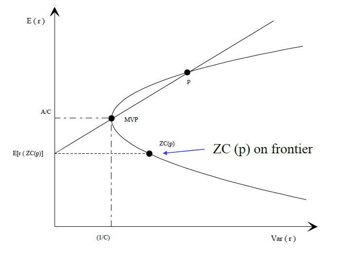

::: {.callout-important appearance="minimal"}
**Copyright Notice.** Planned for publication in 2026 by R. Douglas Martin, Thomas K. Philips, Bernd Scherer, and Kirk Li. All rights reserved. © Copyright 2025.
:::

::: {.callout-note appearance="minimal"}
&#128196; **Full appendix available as PDF.** [Download Appendix D — Portfolio Theory](Appendix%20D%20Portfolio%20Theory.pdf){target="_blank"}
:::

## Overview

This appendix derives the mathematical results underlying classical portfolio theory: the minimum-variance frontier, the Capital Asset Pricing Model (CAPM), the zero-beta CAPM, and the Arbitrage Pricing Theory (APT). It also provides technical details on the robust estimation methods used in the main text.

---

## D.1 — MinVar Frontier Mathematics

In the Global Minimum Variance Portfolios section we showed that the weight vector $\mathbf{w}_{mv}$ that minimizes portfolio variance, subject to the mean return and full investment constraints $\mathbf{w}^{\prime}\boldsymbol{\mu}=\mu_{P}$ and $\mathbf{w}^{\prime}\mathbf{1}=1$, has the form

$$
\mathbf{w}_{\mathrm{mv}}=\lambda_{1}\mathbf{C}^{-1}\boldsymbol{\mu}\,+\,\lambda_{2}\mathbf{C}^{-1}\boldsymbol{1}.
$$

Applying the mean return and full-investment constraints results in two equations in the two unknowns $\lambda_{1}$ and $\lambda_{2}$, and the solution is

$$
\begin{aligned}
\lambda_{1} &= \dfrac{c\mu_{P}\,-\,a}{d}\\[6pt]
\lambda_{2} &= \dfrac{b\,-\,a\mu_{P}}{d}
\end{aligned}
$$

where $a=\mathbf{1}^{\prime}\mathbf{C}^{-1}\boldsymbol{\mu}$, $b=\boldsymbol{\mu}^{\prime}\mathbf{C}^{-1}\boldsymbol{\mu}$, $c=\mathbf{1}^{\prime}\mathbf{C}^{-1}\mathbf{1}>0$, and $d=bc\,-\,a^{2}$.

Substituting $\lambda_{1}$ and $\lambda_{2}$ and simplifying gives

$$
\mathbf{w}_{\mathrm{mv}}=\mathbf{w}_{1}\,+\,\mu_{P}\mathbf{w}_{2}
$$

where

$$
\begin{aligned}
\mathbf{w}_{1} &= \dfrac{1}{d}\left(b\mathbf{C}^{-1}\mathbf{1}\,-\,a\mathbf{C}^{-1}\boldsymbol{\mu}\right)\\[6pt]
\mathbf{w}_{2} &= \dfrac{1}{d}\left(c\mathbf{C}^{-1}\boldsymbol{\mu}\,-\,a\mathbf{C}^{-1}\mathbf{1}\right)
\end{aligned}
$$

and

$$
d = (\boldsymbol{\mu}^{\prime}\mathbf{C}^{-1}\boldsymbol{\mu})(\mathbf{1}^{\prime}\mathbf{C}^{-1}\mathbf{1})\,-\,(\mathbf{1}^{\prime}\mathbf{C}^{-1}\boldsymbol{\mu})^{2} \;\geqslant\; 0.
$$

We show below how this inequality follows from the Cauchy-Schwarz inequality, and that $d$ is positive except in the special case where $\boldsymbol{\mu}=c\mathbf{1}$ for some constant $c$, which does not arise in practice. Also,

$$
\begin{aligned}
c^{-1} &= \sigma_{\mathrm{gmv}}^{2}\\[4pt]
\dfrac{a}{c} &= \mu_{\mathrm{gmv}}
\end{aligned}
$$

where $\mu_{\mathrm{gmv}}$ and $\sigma_{\mathrm{gmv}}^{2}$ are the mean and variance of the global minimum variance (GMV) portfolio.

### Positivity of $d$

Since $\mathbf{C}$ is positive definite so is $\mathbf{C}^{-1}$, and therefore $\mathbf{C}^{-1}$ can be factored as $\mathbf{C}^{-1}=\mathbf{C}^{-1/2}\mathbf{C}^{-1/2}$ where $\mathbf{C}^{-1/2}$ is positive definite. Thus

$$
\begin{aligned}
d &= (\boldsymbol{\mu}^{\prime}\mathbf{C}^{-1/2}\mathbf{C}^{-1/2}\boldsymbol{\mu})\cdot(\mathbf{1}^{\prime}\mathbf{C}^{-1/2}\mathbf{C}^{-1/2}\mathbf{1})\,-\,(\mathbf{1}^{\prime}\mathbf{C}^{-1/2}\mathbf{C}^{-1/2}\boldsymbol{\mu})^{2}\\
&= (\check{\boldsymbol{\mu}}^{\prime}\check{\boldsymbol{\mu}})\cdot(\check{\mathbf{1}}^{\prime}\check{\mathbf{1}})\,-\,(\check{\mathbf{1}}^{\prime}\check{\boldsymbol{\mu}})^{2}
\end{aligned}
$$

where $\check{\boldsymbol{\mu}}=\mathbf{C}^{-1/2}\boldsymbol{\mu}$ and $\check{\mathbf{1}}=\mathbf{C}^{-1/2}\mathbf{1}$. The Cauchy-Schwarz inequality for two vectors $\mathbf{x}$ and $\mathbf{y}$ states that

$$
(\mathbf{x}^{\prime}\mathbf{y})^{2}\leqslant(\mathbf{x}^{\prime}\mathbf{x})\cdot(\mathbf{y}^{\prime}\mathbf{y})\quad\text{with equality if, and only if,}\quad \mathbf{y}=c\cdot\mathbf{x}
$$

for some non-zero constant $c$. Thus $d=0$ if, and only if, $\mathbf{C}^{-1/2}\boldsymbol{\mu}=c\cdot\mathbf{C}^{-1/2}\mathbf{1}$, equivalently if and only if $\boldsymbol{\mu}=c\cdot\mathbf{1}$. This essentially never happens in practice.

---

## D.2 — The Tangent Portfolio is the Market Portfolio Under the CAPM

Under the CAPM assumptions, all market participants hold the tangent portfolio $T$, and the equilibrium assumption implies that supply equals demand. Let $N$ be the number of securities, with $V_{j}$ the market capitalization of the $j^{th}$ security. Then $V=\sum_{j=1}^{N}V_{j}$ is total market capitalization, and $w_{M,\,j}=V_{j}/V$ is the weight of the $j^{th}$ security in the market portfolio.

Let $K$ be the number of investors, where the $k^{th}$ investor invests an amount $\gamma_{k}W_{k}$, $0<\gamma_{k}<1$, in risky assets. The total amount invested in the $j^{th}$ asset by all investors is

$$
\dot{V}_{j}=\sum_{k=1}^{K}\gamma_{k}\,W_{k}\,w_{k,\,j}.
$$

Under the CAPM, all investors hold the same tangent portfolio, so $w_{k,\,j}=w_{j}$ for all $k$. Thus

$$
\dot{V}_{j}=w_{j}\sum_{k=1}^{K}\gamma_{k}\,W_{k}
$$

and $\dot{V}=\sum_{j=1}^{N}\dot{V}_{j}=\sum_{k=1}^{K}\gamma_{k}\,W_{k}$. Under the CAPM equilibrium assumption $\dot{V}_{j}=V_{j}$ and $\dot{V}=V$, which gives

$$
w_{M,\,j}=\dfrac{V_{j}}{V}=\dfrac{\dot{V}_{j}}{\dot{V}}=w_{j},\quad j=1,\,2,\,\ldots\,,\,N
$$

and so the tangent portfolio $T$ is the market portfolio $M$.

---

## D.3 — Proof of the CAPM

The following is a simple proof of the CAPM formula with beta as defined by the CAPM beta definition. Let $M$ be the market portfolio with mean return $\mu_{M}$ and variance $\sigma_{M}^{2}$. As the market portfolio is the tangent portfolio, the Capital Allocation Line associated with the entire market is the **Capital Market Line** (CML):

$$
\mu=r_{f}\,+\,\dfrac{(\mu_{M}\,-\,r_{f})}{\sigma_{M}}\sigma.
$$

Now consider any security with return $r_{i}$, mean $\mu_{i}$ and variance $\sigma_{i}^{2}$, such that $(\mu_{i},\sigma_{i})$ does not lie on the efficient frontier. Form a portfolio $P$ by investing a fraction $\alpha$ in the security and $1-\alpha$ in the market portfolio $M$:

$$
\begin{aligned}
\mu_{P} &= \alpha\mu_{i}\,+\,(1-\alpha)\mu_{M}\\
\sigma_{P} &= \left(\alpha^{2}\sigma_{i}^{2}\,+\,2\alpha(1-\alpha)\sigma_{i,M}\,+\,(1-\alpha)^{2}\sigma_{M}^{2}\right)^{1/2}.
\end{aligned}
$$

The pair $(\mu_{P}(\alpha),\,\sigma_{P}(\alpha))$ traces a curve in mean-standard deviation space as $\alpha$ varies. This curve can never lie above or to the left of the CML, and the slope of the curve at $\alpha=0$ is

$$
\dfrac{d\mu}{d\sigma}(\alpha)\Biggr|_{\alpha=0} = \dfrac{d\mu/d\alpha\big|_{\alpha=0}}{d\sigma/d\alpha\big|_{\alpha=0}},
$$

where the numerator equals $\mu_{i}-\mu_{M}$, and straightforward calculus shows the denominator reduces to $(\sigma_{i,M}-\sigma_{M}^{2})/\sigma_{M}$ when $\alpha=0$. Thus

$$
\dfrac{d\mu}{d\sigma}(\alpha)\Biggr|_{\alpha=0}=\sigma_{M}\dfrac{\mu_{i}-\mu_{M}}{\sigma_{i,M}-\sigma_{M}^{2}}.
$$

Since the curve is tangent to the CML at $\alpha=0$, its slope must equal $(\mu_{M}-r_{f})/\sigma_{M}$, giving

$$
\mu_{M}-r_{f}=\sigma_{M}^{2}\,\dfrac{\mu_{i}-\mu_{M}}{\sigma_{i,M}-\sigma_{M}^{2}},
$$

which upon rearrangement yields the CAPM:

$$
\mu_{i} = r_{f} + \beta_{i}(\mu_{M}-r_{f}), \qquad \beta_{i} = \frac{\sigma_{i,M}}{\sigma_{M}^{2}}.
$$

---

## D.4 — Zero Beta CAPM Derivation

Here we provide a simple derivation of the Zero Beta CAPM using the MinVar portfolio results in Section D.1. The assumptions are the same as for the standard CAPM, except that there is no risk-free asset. In equilibrium, the market portfolio $M$ is a convex combination of the efficient portfolios of all investors, and is therefore efficient.

Recall from Section D.1 that the weight vector of a MinVar efficient portfolio $p$ has the form

$$
\mathbf{w}_{p}=\lambda\mathbf{C}^{-1}\boldsymbol{\mu}\,+\,\gamma\mathbf{C}^{-1}\mathbf{1}.
$$

For any other portfolio $q$ with weight vector $\mathbf{w}_{q}$ and mean return $\mu_{q}$, the covariance of $r_{p}$ and $r_{q}$ is

$$
\begin{aligned}
\mathrm{cov}(r_{p},\,r_{q}) &= \mathbf{w}_{q}^{\prime}\mathbf{C}\mathbf{w}_{p}\\
&= \lambda\mathbf{w}_{q}^{\prime}\boldsymbol{\mu}\,+\,\gamma\mathbf{w}_{q}^{\prime}\mathbf{1}\\
&= \lambda\mu_{q}\,+\,\gamma.
\end{aligned}
$$

A **zero covariance portfolio** $zc(p)$ with mean return $\mu_{zc(p)}$ satisfies

$$
\mathrm{cov}(r_{p},\,r_{zc(p)}) = \lambda\mu_{zc(p)}\,+\,\gamma = 0.
$$

Solving for $\gamma$ and substituting back gives

$$
\begin{aligned}
\mathrm{cov}(r_{p},\,r_{q}) &= \lambda(\mu_{q}-\mu_{zc(p)})\\
\mathrm{var}(r_{p}) &= \lambda(\mu_{p}-\mu_{zc(p)}).
\end{aligned}
$$

Dividing and rearranging, and letting $p$ be the market portfolio $M$, gives the **portfolio-level zero-beta CAPM**:

$$
\mu_{q}=\mu_{zc(M)}\,+\,\beta_{q,\,M}(\mu_{M}\,-\,\mu_{zc(M)}).
$$

Since $q$ is an arbitrary fully-invested portfolio, it can be an individual asset with index $j$, which gives the **asset-level zero-beta CAPM**:

$$
\mu_{j}=\mu_{zc(M)}\,+\,\beta_{j,\,M}\,(\mu_{M}\,-\,\mu_{zc(M)}).
$$

---

## D.5 — Zero Covariance Frontier Portfolios

A portfolio $p$ that has zero covariance with another portfolio $q$ has $\beta_{pq}=0$ and is called a **zero beta** portfolio. Here we discuss the special case of zero covariance frontier portfolios.

Let $p$ denote any efficient frontier portfolio other than the GMV portfolio, and let $zc(p)$ be a frontier portfolio with zero covariance with respect to $p$. Using the covariance formula for frontier portfolios:

$$
\begin{aligned}
\mathrm{cov}(r_{zc(p)},\,r_{p}) &= \sigma_{\mathrm{gmv}}^{2}\,+\,\dfrac{c}{d}\left(\mu_{zc(p)}-\mu_{\mathrm{gmv}}\right)\left(\mu_{p}-\mu_{\mathrm{gmv}}\right) = 0
\end{aligned}
$$

It follows that the expected return of the zero covariance frontier portfolio is:

$$
\mu_{zc(p)}=\mu_{\mathrm{gmv}}\,-\,\dfrac{d}{c}\,\cdot\,\dfrac{\sigma_{\mathrm{gmv}}^{2}}{\mu_{p}\,-\,\mu_{\mathrm{gmv}}}.
$$

Since $\mu_{p}>\mu_{\mathrm{gmv}}$, the second term is positive and $\mu_{zc(p)}<\mu_{\mathrm{gmv}}$ — the zero covariance portfolio is always an **inefficient** frontier portfolio. Its weight vector is

$$
\mathbf{w}_{zc(p)}=\mathbf{w}_{1}\,+\,\mu_{zc(p)}\mathbf{w}_{2}.
$$

The relationship between the efficient frontier portfolio $p$, the GMV portfolio $p_{gmv}$ and the zero covariance portfolio $zc(p)$ is described by the straight line shown in Figure @fig-zero-covariance. Note that the straight line connecting $zc(p)$ and $p$ goes through $p_{gmv}$.

::: {#fig-zero-covariance layout-ncol=1}
{fig-alt="Zero covariance portfolio geometry on the mean-variance frontier"}

Geometry of zero covariance frontier portfolios.
:::

The straight line in the figure is given by

$$
\mu_{r}=\mu_{zc(p)}\,+\,\dfrac{\mu_{p}-\mu_{gmv}}{\sigma_{p}^{2}-\sigma_{gmv}^{2}}\,\sigma_{r}^{2}
$$

and satisfies $\mu_{r}=\mu_{gmv}$ when $\sigma_{r}^{2}=\sigma_{gmv}^{2}$.

---

## D.6 — Proof of the APT

The vector $\mathbf{a}=(a_{1},\,a_{2},\,\ldots,\,a_{n})^{\prime}$ of intercepts in the APT intercepts equation may be written in the least-squares regression fit-plus-residuals form

$$
\mathbf{a} = \hat{\lambda}_{0}\mathbf{1}\,+\,\mathbf{B}\hat{\boldsymbol{\lambda}}\,+\,\mathbf{u}
$$

where $\hat{\lambda}_{0}$ and $\hat{\boldsymbol{\lambda}}=(\hat{\lambda}_{1},\,\ldots,\,\hat{\lambda}_{K})^{\prime}$ are the least-squares regression coefficients, and $\mathbf{u}=(u_{1},\,\ldots,\,u_{n})^{\prime}$ is the vector of regression residuals. As shown in the Least Squares section (Appendix B), the regression residuals vector $\mathbf{u}$ is orthogonal to $\mathbf{1}$ and to the columns of $\mathbf{B}$. Thus $\mathbf{u}^{\prime}\mathbf{1}=\sum_{i=1}^{n}u_{i}=0$ and $\mathbf{u}^{\prime}\mathbf{B}=\mathbf{0}^{\prime}$.

Consider the zero investment portfolio weights vector

$$
\mathbf{w}=\frac{\mathbf{u}}{\sqrt{n}\,\|\mathbf{u}\|}
$$

where $\|\mathbf{u}\|=\sqrt{\sum_{i=1}^{n}u_{i}^{2}}$. Using the APT returns model and the fact that $\mathbf{u}^{\prime}\mathbf{B}=\mathbf{0}^{\prime}$, the arbitrage portfolio $p$ has return

$$
r_{p} = \mathbf{w}^{\prime}\mathbf{r} = \dfrac{1}{\sqrt{n}\,\|\mathbf{u}\|}(\mathbf{u}^{\prime}\mathbf{a}\,+\,\mathbf{u}^{\prime}\boldsymbol{\varepsilon})
$$

and since $\mathrm{E}(\boldsymbol{\varepsilon})=0$, the arbitrage portfolio has mean

$$
\mu_{p} = \dfrac{\mathbf{u}^{\prime}\mathbf{a}}{\sqrt{n}\,\|\mathbf{u}\|} = \dfrac{\mathbf{u}^{\prime}\mathbf{u}}{\sqrt{n}\,\|\mathbf{u}\|} = \dfrac{1}{\sqrt{n}}\,\|\mathbf{u}\|
$$

where the second equality uses the orthogonality of $\mathbf{u}$ to $\mathbf{1}$ and $\mathbf{B}$.

The variance of the arbitrage portfolio is

$$
\mathrm{E}(r_{p}-\mu_{p})^{2} = \dfrac{\mathbf{u}^{\prime}\mathbf{C}\mathbf{u}}{n\,\|\mathbf{u}\|^{2}}
$$

where $\mathbf{C}$ is the covariance matrix of the errors $\boldsymbol{\varepsilon}=(\epsilon_{1},\,\ldots,\,\epsilon_{n})^{\prime}$. We say that the arbitrage portfolio is **asymptotically risk diversifiable** (ARD) if

$$
\lim_{n\rightarrow\infty}\dfrac{\mathbf{u}^{\prime}\mathbf{C}\mathbf{u}}{n\,\|\mathbf{u}\|^{2}}=0.
$$

The simplest condition for ARD is where the $\epsilon_{i}$ are uncorrelated and have bounded variances $\sigma_{i}^{2}<B$; in that case $\mathbf{u}^{\prime}\mathbf{C}\mathbf{u}=\sum_{i=1}^{n}u_{i}^{2}\sigma_{i}^{2}<B\sum_{i=1}^{n}u_{i}^{2}$ and the ratio is bounded by $B/n\to0$.

Suppose the portfolio is ARD and that

$$
\mu_{p,\,\infty}=\lim_{n\rightarrow\infty}\dfrac{1}{\sqrt{n}}\,\|\mathbf{u}\|=\lim_{n\rightarrow\infty}\left(\dfrac{1}{n}\sum_{i=1}^{n}u_{i}^{2}\right)^{1/2}>0.
$$

In that case, the arbitrage portfolio would have an asymptotic sure profit with no risk — impossible in an arbitrage-free market. Therefore the APT condition

$$
\lim_{n\rightarrow\infty}\left(\dfrac{1}{n}\sum_{i=1}^{n}u_{i}^{2}\right)=0
$$

must be satisfied.

---

## D.7 — Robust Estimation Details

### mOpt Psi Function Formula

The mOpt psi function formula is

$$
\psi_{mOpt}(x)=\begin{cases}
x & |x|\leqslant1\\[4pt]
\dfrac{\phi(1)}{\phi(1)-a}\left(x-\mathrm{sgn}(x)\dfrac{a}{\phi(x)}\right)\mathit{U}(c-|x|) & |x|>1
\end{cases}
$$

where $\phi(x)$ is the standard normal density function, $\mathit{U}(x)$ is the unit step function (value 1 for $x\geqslant0$, value 0 for $x<0$), and the constants $a$ and $c$ depend on the desired normal distribution efficiency. Note that $\psi_{mOpt}(x)=0$ for $x$ outside the interval $(-c,\,c)$. A 95% normal distribution efficiency is obtained with $a=0.0132$ and $c=3.004$. The rho function $\rho_{mOpt}(x)$ is obtained by integrating $\psi_{mOpt}(x)$, and because the latter is zero outside $(-c,\,c)$, the rho function is bounded with a constant value outside that interval. Details of the integral of the mOpt psi function, and computing values of $a$ and $c$ from specified normal distribution efficiencies, are provided in Konis and Martin (2021).
