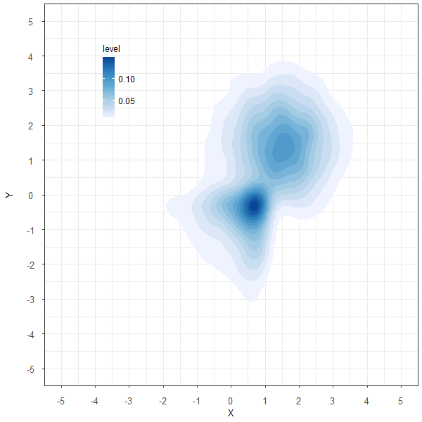
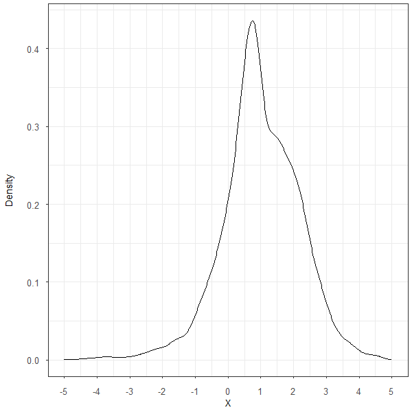
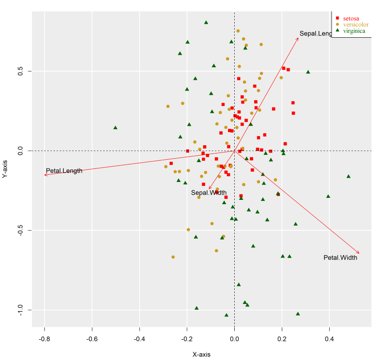
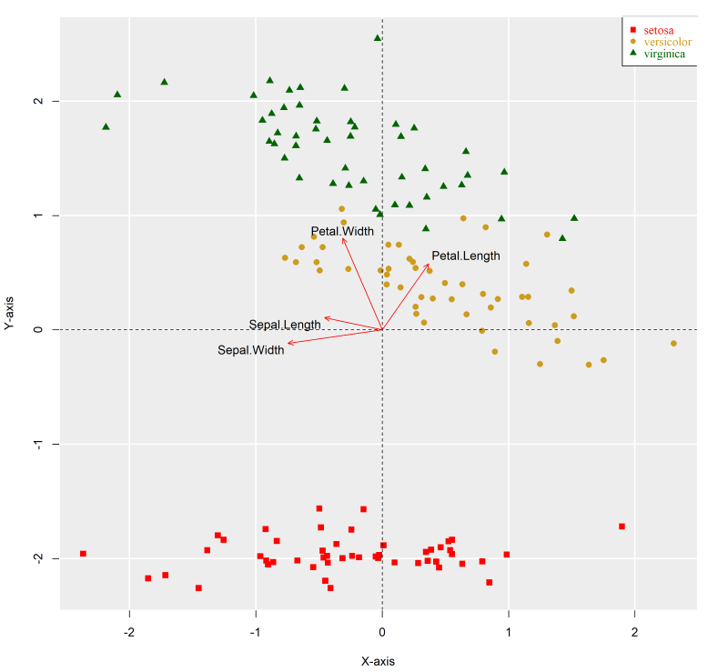

::: {.callout-important appearance="minimal"}
**Copyright Notice.** Planned for publication in 2026 by R. Douglas Martin, Thomas K. Philips, Bernd Scherer, and Kirk Li. All rights reserved. © Copyright 2025.
:::

::: {.callout-note appearance="minimal"}
[Download Appendix E PDF](pdfs/appendix-e.pdf){target="_blank" .btn .btn-outline-primary} &nbsp;&nbsp; The complete PDF is embedded below and available for download.
:::

```{=html}
<iframe src="pdfs/appendix-e.pdf" width="100%" height="950px" style="border: 1px solid #dee2e6; border-radius: 4px;"></iframe>
```

## Overview

This appendix introduces the machine learning methods most relevant to portfolio management: regularized regression, cross-validation for model selection, robust variants of these methods, logistic regression for classification, and projection pursuit and neural network foundations.

---

## E.1 — Overview of Machine Learning

Machine Learning (ML), Large Language Models (LLMs), and Generative Artificial Intelligence (GAI) have had a significant impact on a variety of fields, and we fully expect portfolio management to prove no less vulnerable to their disruptive effects. Breiman (2001) identifies two disjoint statistical cultures:

1. A **data-driven culture** focused on modeling data as if it were drawn from a known parametric distribution, fitting responses to data using methods appropriate to that distribution (e.g., linear regression / least squares for jointly normal random variables), with goodness-of-fit as the primary figure of merit.
2. A **distribution-agnostic culture** focused on identifying an (often high-dimensional) algorithmic relationship between data and system responses, with forecast accuracy as the primary figure of merit.

Breiman (2001) argues that while most statisticians fall into the first group, it is the second group that is focused on what truly matters in the real world — we might call members of the second group ML practitioners. Loosely speaking, ML refers to:

1. Novel application of statistical and algorithmic methods and non-linear transformations to high-dimensional data, as well as the use of non-linear models (e.g., multiplicative models, or models with interaction terms) in order to solve numerical problems such as forecasting future stock returns from current prices and financial statement information.
2. Automatic model selection using regularized regression, as well as by applying measures of model complexity such as AIC (Akaike 1974) and BIC (Schwarz 1978; de Leeuw 1992), and of predictive power such as the Robust Final Predictor Error method covered in the Time Series Factor Models chapter. This type of machine learning has been in use for over fifty years, and continues to be developed with new techniques for model selection.

LLMs and GAI first transform and then process textual or visual data to solve unstructured problems such as summarizing news items, regulatory testimony, or management disclosures in corporate financial statements. ML, LLMs, and GAI should not be seen as mutually exclusive fields — they are better thought of as existing along a continuum, as the techniques and algorithms that underpin them have much in common.

Kelly and Xiu (2023) comprehensively survey the application of Machine Learning methods to problems in finance, and Hastie, Tibshirani and Friedman (2009) and James, Witten, Hastie and Tibshirani (2013) provide rigorous, insightful, and thoughtful coverage of the statistical aspects of machine learning. Gu, Kelly and Xiu (2020) and Cao, Jiang, Wang and Yang (2024) exemplify the application of these methods to asset pricing and the estimation of expected returns.

The distinguishing features of ML methods are their ability to efficiently handle exceptionally large data sets with many explanatory factors, their focus on model selection and mitigating overfits to noisy data, and their ability to model the non-linearities that characterize most real-world problems.

A thoughtful investor must embrace both financial and technological perspectives when employing ML, LLMs, and GAI — the risk of lazy inquiry is the identification of models devoid of economic underpinnings. The all-too-common consequence of such practices is models that generate good results when tested with available data, but fail miserably when faced with new data.

Machine Learning algorithms can usefully be classified into three categories:

1. **Supervised learning:** An algorithm is presented with a set of inputs or *features* (e.g., financial statements and market data) and outputs or *responses* (e.g., stock market returns) and is tasked with identifying the relationship between the two. Formally, given a collection of feature-response pairs $\left[\mathbf{X},\ \mathbf{y}\right]=\left\{\mathbf{x}_{i},\ \mathbf{y}_{i}\right\}$, $1\leqslant i\leqslant N$, as well as a corresponding set of (usually non-negative) weights $w_{i}$ and a loss function $\mathscr{L}$, find a high-dimensional function $f$ such that $\sum_{i}w_{i}\,\mathscr{L}(f(\mathbf{x}_{i})-\mathbf{y}_{i})$ is minimized.
2. **Unsupervised learning:** An algorithm is presented with a collection of objects, each with a set of characteristics, and is tasked with estimating the high-dimensional joint density of the data, or classifying it into a set of disjoint clusters such that items in each cluster are close to each other under some metric and distant from items in other clusters.
3. **Reinforcement learning:** An algorithm is presented with an initial set of inputs and an objective function which it is tasked with maximizing. New inputs are continually incorporated and consumed, and an optimal response is recomputed following each new observation. This approach can be applied to the multi-period optimization of a portfolio whose holdings have time-varying expected returns and transaction costs.

We restrict our exploration to the field of **supervised learning** — a form of learning that is particularly relevant to portfolio management.

---

## E.2 — Supervised Learning Using Regularized Classical Algorithms

The classical linear model

$$
\mathbf{y}_{N\times1}=\mathbf{X}_{N\times p}\ \boldsymbol{\beta}_{p\times1}\,+\,\boldsymbol{\varepsilon}_{N\times1}
$$

is used for time series and cross-section factor models in the Factor Models chapters, and is described in detail in Appendix B. It minimizes $\boldsymbol{\varepsilon}^{\prime}\boldsymbol{\varepsilon}$ and the solution is given by

$$
\hat{\boldsymbol{\beta}}_{LS} = \underset{\boldsymbol{\beta}}{\mathrm{argmin}}\ \boldsymbol{\varepsilon}^{\prime}\boldsymbol{\varepsilon} = \left(\mathbf{X}^{\prime}\mathbf{X}\right)^{-1}\mathbf{X}^{\prime}\mathbf{y}.
$$

This formula gives us insights into the limitations of Least Squares:

1. If $p>N$, no unique solution exists because $\mathbf{X}^{\prime}\mathbf{X}$ is singular — an increasingly important use case in genomics and in finance, as researchers often throw every available explanatory variable into "kitchen sink" regressions.
2. If the columns of $\mathbf{X}$ are nearly co-linear (e.g., Comprehensive Income, Net Income and Operating Income from a firm's financial statements), $\mathbf{X}^{\prime}\mathbf{X}$ becomes nearly singular and the coefficient estimates become unstable.
3. Least Squares does not perform variable selection: even if the true relationship is encapsulated in a small subset of the entries in $\boldsymbol{\beta}$, Least Squares will likely assign non-zero values to all entries.
4. If the true relationship between $\mathbf{X}$ and $\mathbf{y}$ is non-linear, any transformation of the columns of $\mathbf{X}$ must be done ahead of time by the analyst.
5. Least Squares is not robust to even a single outlier. Robust methods are described in the Robust Estimation sections and the Robust Estimators chapter.

Some, though not all, of these problems can be addressed using **regularization** techniques.

### Regularization

The central idea that underlies regularization is simple: constrain the weights $\boldsymbol{\beta}$ in some way so that they become more stable and/or more sparse, and computable even if $p>N$. For notational simplicity, we assume that all columns of $\mathbf{X}$ and $\mathbf{y}$ are demeaned. Define

$$
\|\boldsymbol{\varepsilon}\|^{2} = \boldsymbol{\varepsilon}^{\prime}\boldsymbol{\varepsilon} = \left(\mathbf{y}-\mathbf{X}\,\boldsymbol{\beta}\right)^{\prime}\left(\mathbf{y}-\mathbf{X}\,\boldsymbol{\beta}\right)
$$

and

$$
\|\boldsymbol{\beta}\|_{q}=\sum_{i=1}^{p}\left|\boldsymbol{\beta}_{i}\right|^{q},\quad q\geqslant0.
$$

Note that $\|\boldsymbol{\beta}\|_{0}$ is the number of non-zero components of $\boldsymbol{\beta}$; when $q=1$ it is the sum of absolute values; when $q=2$ it is the square of the Euclidean length. Regularization reformulates the least squares objective function to

$$
\hat{\boldsymbol{\beta}}_{q}=\underset{\boldsymbol{\beta}}{\mathrm{argmin}}\ \|\boldsymbol{\varepsilon}\|^{2}\,+\,\lambda_{q}\|\boldsymbol{\beta}\|_{q},\quad q,\ \lambda_{q}\geqslant0.
$$

When $\lambda_{q}=0$, we are back to classical Least Squares for all $q\geqslant0$. When $q=1$ and $\lambda_{1}>0$, we are trading off Mean Squared Error against the sum of the magnitudes of all coefficients — this is known as **lasso** (Least Absolute Shrinkage and Selection Operator, Tibshirani 1996, 2011). When $q=2$ and $\lambda_{2}>0$, we are trading off Mean Squared Error against the square of the Euclidean length of the coefficient vector — this is known as **ridge regression** (Hoerl and Kennard 1970, Hastie 2020). The optimal value of $\lambda$ is determined using **cross-validation**.

Figure @fig-constraint-surfaces illustrates the shape of the constraint boundaries for lasso, ridge regression, and the elastic net, with two explanatory variables.

::: {#fig-constraint-surfaces layout-ncol=1}
{fig-alt="Constraint surfaces for Lasso, Ridge, and Elastic Net"}

Constraint surfaces for Lasso, Ridge, and Elastic Net (two-variable case).
:::

### Ridge Regression

The objective function for ridge regression can be written in two equivalent ways:

$$
\hat{\boldsymbol{\beta}}_{ridge} = \underset{\boldsymbol{\beta}}{\mathrm{argmin}}\ \|\boldsymbol{\varepsilon}\|^{2}\,+\,\lambda\|\boldsymbol{\beta}\|_{2},\quad \lambda>0
$$

$$
= \underset{\boldsymbol{\beta}}{\mathrm{argmin}}\ \|\boldsymbol{\varepsilon}\|^{2},\quad \mathrm{s.t.}\ \|\boldsymbol{\beta}\|_{2}\leqslant c,\ c>0.
$$

The quadratic penalty term ensures that a closed-form solution always exists:

$$
\hat{\boldsymbol{\beta}}_{ridge}=\left(\mathbf{X}^{\prime}\mathbf{X}\,+\,\lambda\,\mathbf{I}_{p\times p}\right)^{-1}\mathbf{X}^{\prime}\mathbf{y}.
$$

Simple rearrangement shows that

$$
\hat{\boldsymbol{\beta}}_{ridge}=\left(\mathbf{I}_{p\times p}\,+\,\lambda\,\left(\mathbf{X}^{\prime}\mathbf{X}\right)^{-1}\right)^{-1}\hat{\boldsymbol{\beta}}_{LS}.
$$

In the special case when the columns of $\mathbf{X}$ are orthonormal, this reduces to

$$
\hat{\boldsymbol{\beta}}_{ridge}=\frac{\hat{\boldsymbol{\beta}}_{LS}}{1+\lambda}.
$$

Ridge regression is not linearly equivariant — the regularization penalty is proportionately larger for columns of $\mathbf{X}$ with low variance. It is the norm, therefore, to standardize all columns of $\mathbf{X}$ to have sample mean 0 and sample variance 1 before solving. Ridge regression does not reduce the number of coefficients in a model — it simply shrinks them all towards zero and each other as $\lambda$ increases.

Hastie (2020) uses the **Singular Value Decomposition** (SVD) to derive an illuminating representation. Writing

$$
\mathbf{X}_{N\times p}=\mathbf{U}_{N\times N}\mathbf{D}_{N\times p}\mathbf{V}_{p\times p}^{\prime}
$$

with $\mathbf{U}^{\prime}\mathbf{U}=\mathbf{V}^{\prime}\mathbf{V}=\mathbf{I}$ and $\mathbf{D}$ diagonal with non-increasing diagonal entries, substituting into the ridge solution gives

$$
\hat{\boldsymbol{\beta}}_{ridge}=\sum_{i:\,\mathbf{D}_{ii}>0}\mathbf{v}_{i}\frac{\mathbf{D}_{ii}}{\mathbf{D}_{ii}^{2}+\lambda}\,\mathbf{u}_{i}^{\prime}\mathbf{y}
$$

and the fitted values are

$$
\hat{\mathbf{y}} = \sum_{i:\,\mathbf{D}_{ii}>0}\mathbf{u}_{i}\,\frac{\mathbf{D}_{ii}^{2}}{\mathbf{D}_{ii}^{2}+\lambda}\,\mathbf{u}_{i}^{\prime}\mathbf{y}.
$$

The SVD representation makes clear that (1) small singular values are shrunk more than large singular values, and (2) the large singular values do not necessarily contribute to the prediction — the dot product $\mathbf{u}_{i}^{\prime}\mathbf{y}$ is just as important as the magnitude of $\mathbf{D}_{ii}$.

As $\lambda\to0$, the ridge solution converges to the OLS solution even when the system is underdetermined (i.e., when $p>N$), in which case it represents the minimum-norm OLS solution.

### Lasso

Lasso replaces ridge regression's quadratic penalty with a linear (in absolute value) penalty. The objective function can be written as:

$$
\hat{\boldsymbol{\beta}}_{lasso} = \underset{\boldsymbol{\beta}}{\mathrm{argmin}}\ \|\boldsymbol{\varepsilon}\|^{2}\,+\,\lambda\|\boldsymbol{\beta}\|_{1},\quad \lambda>0
$$

$$
= \underset{\boldsymbol{\beta}}{\mathrm{argmin}}\ \|\boldsymbol{\varepsilon}\|^{2},\quad \mathrm{s.t.}\ \|\boldsymbol{\beta}\|_{1}<c,\ c>0.
$$

In the special case when the columns of $\mathbf{X}$ are orthonormal, the solution to the lasso is

$$
\hat{\boldsymbol{\beta}}_{lasso}=\left(\left|\hat{\boldsymbol{\beta}}_{LS}\right|-\frac{\lambda}{2}\boldsymbol{1}\right)^{+}\odot\mathrm{sgn}\left(\hat{\boldsymbol{\beta}}_{LS}\right),
$$

where $x^{+}=\max(x,\,0)$ and $\odot$ denotes the element-wise (Hadamard) product.

The sharp corners at the intersections of the constraint planes induce **sparsity** — unlike ridge regression, lasso naturally selects a subset of the explanatory variables and assigns zero weight to the others. The computation of $\hat{\boldsymbol{\beta}}_{lasso}$ is a constrained quadratic program that can be solved using the computationally efficient LARS (Least Angle Regression) algorithm (Efron, Hastie, Johnstone and Tibshirani 2004).

Lasso lacks the **oracle property**: if the true model is based on a subset $\mathcal{P}$ of the available regressors with cardinality $p^{\prime}<p$, then as $N\to\infty$ an oracular algorithm should satisfy

$$
\hat{\boldsymbol{\beta}}_{i}=0,\quad i\notin\mathcal{P},\qquad \sqrt{N}\left(\hat{\boldsymbol{\beta}}_{\mathcal{P}}-\boldsymbol{\beta}_{\mathcal{P}}\right)\longrightarrow N\left(\mathbf{0},\ \boldsymbol{\Sigma}^{*}\right),
$$

where $\boldsymbol{\Sigma}^{*}$ is the covariance matrix of the true subset model. Zou (2006) shows that the **adaptive lasso**

$$
\hat{\boldsymbol{\beta}}_{adaptive\ lasso}=\underset{\boldsymbol{\beta}}{\mathrm{argmin}}\ \|\boldsymbol{\varepsilon}\|^{2}\,+\,\lambda\sum_{i=1}^{p}w_{i}\left|\boldsymbol{\beta}\right|_{i},\quad \lambda>0
$$

achieves the oracle property if the weights $w_{i}=\left(1/\left|\boldsymbol{\beta}_{\sqrt{N}-consistent,\,i}\right|\right)^{\gamma}$, $\gamma>0$, are derived from the coefficients of some other $\sqrt{N}$-consistent estimator of $\boldsymbol{\beta}$ such as ridge regression.

The **relaxed lasso** (Hastie, Tibshirani and Tibshirani 2020) is a weighted average of the pure lasso estimate and the restricted least squares estimate:

$$
\hat{\boldsymbol{\beta}}_{relaxed\ lasso}(\lambda,\ \gamma)=\gamma\,\hat{\boldsymbol{\beta}}_{lasso}\,+\,(1-\gamma)\hat{\boldsymbol{\beta}}_{LS}(S_{\lambda}),\quad 0<\lambda,\ 0\leqslant\gamma\leqslant1,
$$

where $S_{\lambda}$ is the set of variables chosen by lasso and $\hat{\boldsymbol{\beta}}_{LS}(S_{\lambda})$ is the LS coefficient vector on that subset. Relaxed lasso performs about as well as lasso when the signal-to-noise ratio (SNR) is low, and about as well as best subset selection when SNR is high — the low-SNR case being of greatest relevance to finance.

### The Elastic Net

Zou and Hastie (2005) combine the ridge and lasso penalties to form the **elastic net**, which inherits both the sparsity of lasso and the ability of ridge regression to preserve and equally weight groups of correlated variables. The naïve elastic net solves

$$
\hat{\boldsymbol{\beta}}_{na\ddot{i}ve\ elastic\ net} = \underset{\boldsymbol{\beta}}{\mathrm{argmin}}\|\boldsymbol{\varepsilon}\|^{2}\,+\,\lambda\left(\alpha\|\boldsymbol{\beta}\|_{1}\,+\,(1-\alpha)\|\boldsymbol{\beta}\|_{2}\right),\quad \lambda>0,\ 0<\alpha<1.
$$

Zou and Hastie (2005) show that the solution to the naïve elastic net is identical to the lasso on augmented data sets $\mathbf{X}^{*}$ and $\mathbf{y}^{*}$, where

$$
\mathbf{X}_{(N+p)\times p}^{*}=\frac{1}{\sqrt{1+\lambda_{2}}}\left[\begin{array}{c}\mathbf{X}_{N\times p}\\ \sqrt{\lambda_{2}}\,\mathbf{I}_{p\times p}\end{array}\right], \qquad \mathbf{y}_{(N+p)\times1}^{*}=\left[\begin{array}{c}\mathbf{y}_{N\times1}\\ \mathbf{0}_{p\times1}\end{array}\right].
$$

Letting $\gamma=\tfrac{\lambda_{1}}{\sqrt{1+\lambda_{2}}}$ and $\boldsymbol{\beta}^{*}=\sqrt{1+\lambda_{2}}\,\boldsymbol{\beta}$,

$$
\hat{\boldsymbol{\beta}}_{na\ddot{i}ve\ elastic\ net}=\frac{1}{\sqrt{1+\lambda_{2}}}\times\left[\underset{\boldsymbol{\beta}^{*}}{\mathrm{argmin}}\|\boldsymbol{\varepsilon}^{*}\|^{2}\,+\,\gamma\|\boldsymbol{\beta}^{*}\|_{1}\right],\quad \gamma>0,
$$

so that the naïve elastic net is just lasso applied to an augmented data set!

In the orthonormal case:

$$
\hat{\boldsymbol{\beta}}_{na\ddot{i}ve\ elastic\ net}=\frac{\left(\left|\hat{\boldsymbol{\beta}}_{LS}\right|-\frac{\lambda_{1}}{2}\boldsymbol{1}\right)^{+}\odot\mathrm{sgn}\left(\hat{\boldsymbol{\beta}}_{LS}\right)}{1+\lambda_{2}}.
$$

Comparing ridge, lasso, and the naïve elastic net in the orthonormal case: ridge shrinks but does not select, lasso selects and thresholds but does not shrink, and the naïve elastic net does both. In addition, the elastic net has a **grouping property** — it gives highly correlated variables similar weights. If the $i^{th}$ and $j^{th}$ components of $\hat{\boldsymbol{\beta}}_{na\ddot{i}ve\ elastic\ net}$ are positively correlated,

$$
\left|\hat{\boldsymbol{\beta}}_{na\ddot{i}ve\ elastic\ net,\,i}-\hat{\boldsymbol{\beta}}_{na\ddot{i}ve\ elastic\ net,\,j}\right|\leqslant\frac{\|\mathbf{y}\|_{1}}{\lambda_{2}}\sqrt{2(1-\rho)},
$$

where $\rho$ is the sample correlation between the $i^{th}$ and $j^{th}$ columns of $\mathbf{X}$.

In practice the naïve elastic net tends to over-shrink. Zou and Hastie (2005) suggest undoing the ridge-like shrinkage by scaling by $1+\lambda_{2}$ to obtain the **elastic net**:

$$
\hat{\boldsymbol{\beta}}_{elastic\ net} = (1+\lambda_{2})\times\hat{\boldsymbol{\beta}}_{na\ddot{i}ve\ elastic\ net} = \sqrt{1+\lambda_{2}}\times\left[\underset{\boldsymbol{\beta}^{*}}{\mathrm{argmin}}\|\boldsymbol{\varepsilon}^{*}\|^{2}\,+\,\gamma\,\|\boldsymbol{\beta}^{*}\|_{1}\right].
$$

Zou and Zhang (2009) show that a variant they call the **adaptive elastic net**,

$$
\hat{\boldsymbol{\beta}}_{adaptive\ elastic\ net}=(1+\lambda_{2})\times\underset{\boldsymbol{\beta}}{\mathrm{argmin}}\|\boldsymbol{\varepsilon}\|^{2}\,+\,\lambda_{1}\sum_{i=1}^{p}w_{i}\left|\boldsymbol{\beta}\right|_{i}\,+\,\lambda_{2}\|\boldsymbol{\beta}\|_{2},\quad \lambda_{1},\ \lambda_{2}>0,
$$

where $w_{i}=(1/|\boldsymbol{\beta}_{elastic\ net,\,i}|)^{\gamma}$, $\gamma>0$, exhibits the oracle property.

The R package `glmnet` provides efficient implementations of all these methods.

### Cross-Validation

Cross-validation involves splitting the training data set into two or more parts, some used for model building and others for model testing ahead of implementation.

**Leave-out-one cross-validation** creates $N-1$ data sets by removing the $i^{th}$ row of $\mathbf{X}$ and $\mathbf{y}$ for $1\leqslant i\leqslant N$. The mean squared error as a function of $\lambda$ is

$$
MSE(\lambda)=\frac{1}{N}\sum_{i=1}^{N}\left(\hat{\mathbf{y}}_{i}-\mathbf{y}_{i}\ |\ \lambda\right)^{2},
$$

and the optimal $\lambda$ is

$$
\lambda^{*}=\underset{\lambda}{\mathrm{argmin}\ }MSE(\lambda).
$$

When $N$ is large, **$k$-fold cross-validation** splits the data into $k\ll N$ subgroups. Breiman and Spector (1992) suggest $k=5$, though $k=10$ is also commonly used.

When the data has a **temporal component**, a training-validation-testing split is used: the training set builds models with a range of $\lambda$ values; the validation set selects the best $\lambda$; and the testing set (held out completely during training and validation) provides the final evaluation. An alternative is the **expanding window** approach: starting from some initial period $T_0$, fit a model over $1,\ldots,T_0$, forecast period $T_0+1$, then expand the window and repeat.

---

## E.3 — Robust Regularized Regression

Even though robust statistical methods have made inroads into statistical modeling and have seen some application in portfolio management, they are far from being a standard method in the field of machine learning. The R package `pense` has robust extensions of ridge, lasso and elastic net estimators; a good discussion can be found in Chapter 5 of Maronna (2019) and in Freue, Kepplinger, Salibián-Barrera and Smucler (2019).

The central idea in robust regularization is to replace $\|\boldsymbol{\varepsilon}\|^{2}$ in the various objective functions with $\sum_{i}\rho(\boldsymbol{\varepsilon}_{i}/\hat{s})$ for some symmetric loss function $\rho(\cdot)$ and some robust estimator of scale $\hat{s}$.

### Robust Ridge Regression

Maronna (2011) describes a robust algorithm for ridge regression that is best thought of as a weighted version of the ridge objective with data-dependent weights $\mathbf{w}$. If we let $\mathbf{W}_{N\times N}=\mathrm{diag}(\mathbf{w})$, the robust ridge solution is

$$
\hat{\mu},\ \hat{\boldsymbol{\beta}}_{robust\ ridge}=\left(\mathbf{X}^{\prime}\mathbf{W}\mathbf{X}\,+\,\lambda\,\mathbf{I}_{p\times p}\right)^{-1}\mathbf{X}^{\prime}\mathbf{W}\left(\mathbf{y}-\hat{\mu}\boldsymbol{1}_{N}\right),
$$

where $\hat{\mu}$, $\hat{\boldsymbol{\beta}}_{robust\ ridge}$, and $\mathbf{W}$ must be identified iteratively. The weights

$$
\mathbf{w}_{i}=\frac{\psi(\boldsymbol{\varepsilon}_{i})}{\boldsymbol{\varepsilon}_{i}}
$$

are determined by applying the robust weights definition to the residuals $\boldsymbol{\varepsilon}=\mathbf{y}-\hat{\mu}\boldsymbol{1}_{N}-\mathbf{X}\hat{\boldsymbol{\beta}}_{robust\ ridge}$.

Maronna (2011) starts with a highly robust (but potentially inefficient) regression estimator to obtain initial estimates $\hat{\mu}_{0}$ and $\hat{\boldsymbol{\beta}}_{0}$, computes the residuals $\boldsymbol{\varepsilon}_{0}$, and obtains an initial scale estimate $\hat{\sigma}_{0}$ by solving

$$
\frac{1}{N}\sum_{i=1}^{N}\rho_{0}\left(\frac{\boldsymbol{\varepsilon}_{0,\,i}}{\hat{\sigma}_{0}}\right)=\delta,
$$

where $\rho_{0}(x)=\rho_{Bisquare}(x/c_{0})=\min\left(1,\,1-(1-(x/c_{0})^{2})^{3}\right)$ and the values of $\delta$ and $c_{0}$ determine the algorithm's robustness. Using the initial scale estimate and an estimate of the equivalent degrees of freedom, the algorithm adjusts $c_{0}$ to a new value $c$ that assures a desired level of normal efficiency when minimizing the loss function

$$
\mathscr{L}(\mathbf{X},\ \mathbf{y},\ \mu,\ \boldsymbol{\beta})=\hat{\sigma}_{0}^{2}\cdot\sum_{i=1}^{N}\rho\left(\frac{\boldsymbol{\varepsilon}_{i}(\boldsymbol{\beta})}{\hat{\sigma}_{0}}\right)+\lambda\|\boldsymbol{\beta}\|_{2},
$$

where $\rho(x)=\min(1,\,1-(1-(x/c)^{2})^{3})$. The iterative procedure then repeatedly updates $\mathbf{W}$, $\hat{\boldsymbol{\beta}}_{robust\ ridge}$, and $\hat{\mu}$ until changes in $\boldsymbol{\varepsilon}$ are sufficiently small.

Robust ridge regression is implemented by the function `regmest` in the R package `pense` with the parameter `alpha` set to 0. For cross-validated robust ridge regression, the corresponding function is `regmest_cv()`.

### Robust Lasso and Elastic Net (PENSE and PENSEM)

Freue, Kepplinger, Salibián-Barrera and Smucler (2019) describe a flexible family of robust estimators that can implement models ranging from ridge regression through elastic net to lasso by changing a single parameter $\alpha$. They consider two loss functions:

$$
\mathscr{L}_{PS}(\mathbf{X},\ \mathbf{y},\ \mu,\ \boldsymbol{\beta}) = \sigma^{2}(\mu,\ \boldsymbol{\beta})\,+\,\lambda_{S}\left(\alpha\|\boldsymbol{\beta}\|_{1}\,+\,\frac{1-\alpha}{2}\|\boldsymbol{\beta}\|_{2}\right),\quad \lambda_{S}>0,\ 0\leqslant\alpha\leqslant1
$$

$$
\mathscr{L}_{PM}(\mathbf{X},\ \mathbf{y},\ \mu,\ \boldsymbol{\beta}) = \frac{1}{N}\sum_{i=1}^{N}\rho\left(\frac{\boldsymbol{\varepsilon}_{i}(\mu,\ \boldsymbol{\beta})}{\hat{\sigma}_{0}}\right)\,+\,\lambda_{M}\left(\alpha\|\boldsymbol{\beta}\|_{1}\,+\,\frac{1-\alpha}{2}\|\boldsymbol{\beta}\|_{2}\right),\quad \lambda_{M}>0,\ 0\leqslant\alpha\leqslant1.
$$

The presence of the variance in the first identifies it as an S-estimator loss and the presence of the $\rho$ function in the second identifies it as an M-estimator loss. The corresponding estimators are known as **PENSE** (Penalized Elastic Net S-Estimator) and **PENSEM** (Penalized Elastic Net S-Estimator — M step).

Kepplinger (2023) and Kepplinger and Cohen (2023) describe adaptive versions of PENSE and PENSEM that reduce the bias of large coefficients and improve variable selection. An initial estimate of $\boldsymbol{\beta}$ is obtained using robust ridge regression, and these coefficients then weight both the magnitude and the square of the individual components of $\boldsymbol{\beta}$ in revised loss functions:

$$
\mathscr{L}_{APS}(\mathbf{X},\ \mathbf{y},\ \mu,\ \boldsymbol{\beta}) = \sigma^{2}(\mu,\ \boldsymbol{\beta})\,+\,\lambda_{S}\sum_{i=1}^{p}w_{i}\left(\alpha\,|\boldsymbol{\beta}_{i}|\,+\,\frac{1-\alpha}{2}\boldsymbol{\beta}_{i}^{2}\right)
$$

$$
\mathscr{L}_{APM}(\mathbf{X},\ \mathbf{y},\ \mu,\ \boldsymbol{\beta}) = \frac{1}{N}\sum_{i=1}^{N}\rho\left(\frac{\boldsymbol{\varepsilon}_{i}(\mu,\ \boldsymbol{\beta})}{\hat{\sigma}_{0}}\right)\,+\,\lambda_{M}\sum_{i=1}^{p}w_{i}\left(\alpha\,|\boldsymbol{\beta}_{i}|\,+\,\frac{1-\alpha}{2}\boldsymbol{\beta}_{i}^{2}\right)
$$

where $w_{i}=(1/|\boldsymbol{\beta}_{robust\ ridge,\,i}|)^{\gamma}$, $\gamma>0$. The function `adamest_cv()` in `pense` implements adaptive scaling for both lasso and elastic net.

---

## E.4 — Classification and Robust Logistic Regression

Sometimes we are tasked with mapping a set of features to a set of $K$ distinct classes $C_{1},\,C_{2},\ldots,\,C_{K}$, such as the digits 0–9 ($K=10$), or the recessionary and expansionary states of the economy ($K=2$). The linear models we have discussed are ill suited to this task. Classification can be done in several ways:

1. If the categories are naturally ordered, use a regularized regression algorithm to regress their numerical values against the features, and map $\hat{y}$ to a category by comparing it to a set of $K-1$ thresholds $-\infty<T_{1}<T_{2}<\cdots<T_{K-1}<\infty$.
2. If the categories are not naturally ordered, create a set of $K$ linear models, one for each class $C_{j}$, and assign an observation to the class whose fitted output is the largest.
3. If the identification problem maps naturally to choosing the class with the highest posterior probability, apply a non-linear transformation $g(\cdot)$ to map $\hat{y}_{j}$ to the probability that given features correspond to an item from $C_{j}$. This is most easily done using **logistic regression** when $K=2$.

### Logistic Regression

Logistic regression bridges two observations: the response of a linear model $\hat{y}$ is unbounded, while probability distributions are bounded between 0 and 1. These can be reconciled by mapping $\hat{y}$ to the conditional probability that an observation $\mathbf{x}$ is associated with $C_{2}$ via a **link function** $g(\cdot)$:

$$
g(\hat{y}) = F(\hat{y},\,\boldsymbol{\theta}) = \Pr[\mathbf{x}\in C_{2}] \triangleq p(\mathbf{x}).
$$

Logistic regression uses the **logit** (quantile function of the standard logistic distribution) as the link:

$$
\hat{y} = \mathbf{x}^{\prime}\boldsymbol{\beta} = \ln\left(\frac{p(\mathbf{x})}{1-p(\mathbf{x})}\right),
$$

where the bracketed term is known as the **odds** (the entire right-hand side is the **log odds**). Inverting:

$$
p(\mathbf{x}) = \frac{\exp(\hat{y})}{1+\exp(\hat{y})} = \frac{\exp(\mathbf{x}^{\prime}\boldsymbol{\beta})}{1+\exp(\mathbf{x}^{\prime}\boldsymbol{\beta})} = \frac{1}{1+\exp(-\mathbf{x}^{\prime}\boldsymbol{\beta})}.
$$

When we are given a feature matrix $\mathbf{X}$ whose $i^{th}$ row is $\mathbf{X}_{i}$:

$$
p(\mathbf{X}_{i}) = \frac{\exp(\mathbf{X}_{i}\boldsymbol{\beta})}{1+\exp(\mathbf{X}_{i}\boldsymbol{\beta})} = \frac{1}{1+\exp(-\mathbf{X}_{i}\boldsymbol{\beta})}.
$$

If the rows of $\mathbf{X}$ are independent, the **log-likelihood function** of $\boldsymbol{\beta}$ is

$$
\begin{aligned}
l(\boldsymbol{\beta}) &= \ln\prod_{i=1}^{N}\left(p(\mathbf{X}_{i})\right)^{\mathbf{c}_{i}}\left(1-p(\mathbf{X}_{i})\right)^{1-\mathbf{c}_{i}}\\
&= \sum_{i=1}^{N}\mathbf{c}_{i}\cdot\mathbf{X}_{i}\boldsymbol{\beta}\ -\ \sum_{i=1}^{N}\ln\left(1+\exp(\mathbf{X}_{i}\boldsymbol{\beta})\right),
\end{aligned}
$$

where $\mathbf{c}_{i}\in\{0,1\}$ is the class label. The gradient and Hessian are

$$
\nabla l(\boldsymbol{\beta}) = \sum_{i=1}^{N}\left(\mathbf{c}_{i}-\frac{\exp(\mathbf{X}_{i}\boldsymbol{\beta})}{1+\exp(\mathbf{X}_{i}\boldsymbol{\beta})}\right)\mathbf{X}_{i}^{\prime}
$$

$$
\mathbf{H}(\boldsymbol{\beta}) = -\sum_{i=1}^{N}\mathbf{X}_{i}^{\prime}\mathbf{X}_{i}\,\frac{\exp(\mathbf{X}_{i}\boldsymbol{\beta})}{\left(1+\exp(\mathbf{X}_{i}\boldsymbol{\beta})\right)^{2}}.
$$

We identify $\boldsymbol{\beta}_{Logistic\ Regression}$ by setting $\nabla l(\boldsymbol{\beta})=\mathbf{0}$ and using gradient descent to iteratively identify the solution.

Logistic regression can be regularized by adding an elastic net penalty to the log-likelihood:

$$
\mathscr{L}_{LR}(\mathbf{X},\ \mathbf{y},\ \mu,\ \boldsymbol{\beta})=-\frac{1}{N}\,l(\boldsymbol{\beta})\,+\,\lambda_{LR}\left(\alpha\|\boldsymbol{\beta}\|_{1}\,+\,\frac{1-\alpha}{2}\|\boldsymbol{\beta}\|_{2}\right),\quad \lambda_{LR}\geqslant0,\ 0\leqslant\alpha\leqslant1.
$$

It proves useful to routinely include a small ridge penalty when running logistic regression to protect against divergence in the special case when the classes are completely separated — in this case, the MLE of $\boldsymbol{\beta}$ is not unique and some entries can become infinite.

**Robust logistic regression** is subtly different from robust linear regression, as the responses fall into a finite number of buckets, so that while errors may exist in some responses, no outliers can exist. The features, on the other hand, are unbounded and can act as **leverage points** if they lie far away from the majority of the features.

The influence function of the MLE for logistic regression is

$$
IF(\mathbf{c},\ \mathbf{X},\ \boldsymbol{\beta})=\left(\frac{1}{N}\sum_{i=1}^{N}\mathbf{X}_{i}^{\prime}\mathbf{X}_{i}\,\frac{\exp(\mathbf{X}_{i}\boldsymbol{\beta})}{\left(1+\exp(\mathbf{X}_{i}\boldsymbol{\beta})\right)^{2}}\right)^{-1}\cdot\sum_{i=1}^{N}\left(\mathbf{c}_{i}-\frac{\exp(\mathbf{X}_{i}\boldsymbol{\beta})}{1+\exp(\mathbf{X}_{i}\boldsymbol{\beta})}\right)\mathbf{X}_{i}^{\prime}.
$$

As the magnitude of the bracketed term in the sum is bounded by 1, the primary determinant of the impact of an added observation on $\boldsymbol{\beta}$ is $\mathbf{X}_{i}$. Robust logistic regression applies a data-dependent weight $\mathbf{W}_{i}$ that depends on how far $\mathbf{X}_{i}$ is from its distribution:

$$
\sum_{i=1}^{N}\mathbf{W}_{i}\left(\mathbf{c}_{i}-\frac{\exp(\mathbf{X}_{i}\boldsymbol{\beta})}{1+\exp(\mathbf{X}_{i}\boldsymbol{\beta})}\right)\mathbf{X}_{i}^{\prime}=\mathbf{0},
$$

where the weights $\mathbf{W}$ are derived from a robust estimate of the Mahalanobis distances of the rows of $\mathbf{X}$ from their common distribution. The R package `RobstatTM` implements the weighted robust logistic regression algorithm `logregWBY` (Bianco and Yohai 1996, Croux and Haesbroeck 2003).

---

## E.5 — Projection Pursuit Regression and Neural Networks

### Projection Pursuit

Least squares and its derivatives provide powerful ways to identify structure in a high-dimensional space by optimally projecting features onto a low-dimensional subspace. But what if the features exhibit clustering when projected onto some special hyperplane, or can be made more visually informative by first scaling and rotating?

Figure @fig-projections illustrates the nature of the problem. The plotted data is a mixture of two independent random variables $Z_{1}$ and $Z_{2}$: $Z_{1}$ is normally distributed with mean 1.5 and variance 1, while $Z_{2}$ is exponential with mean 1. The variables $X$ and $Y$ are derived from $Z_{1}$ and $Z_{2}$ as follows:

$$
X = Z_{1}\ \text{w.p.}\ \tfrac{2}{3},\quad 1-Z_{2}\ \text{w.p.}\ \tfrac{1}{3}; \qquad Y = Z_{1}\ \text{w.p.}\ \tfrac{2}{3},\quad -Z_{2}\ \text{w.p.}\ \tfrac{1}{3}.
$$

The scatter plot displays the actual data, the density plot shows the concentration of the points (a 45° line nicely separates the two distributions), the density of $X$ shows only a single peak, and the density of $Y$ identifies both peaks but suggests they are almost equally likely. Only the joint view reveals the true structure.

::: {#fig-projections layout="[[1,1],[1,1]]"}
{fig-alt="Scatter plot of x and y"}

{fig-alt="2d density plot of x and y"}

{fig-alt="1d density of x"}

{fig-alt="1d density of y"}

Four views of two variables and their densities.
:::

**Projection pursuit** (the name appears to have been first mentioned in Friedman and Tukey 1974) is the process of exposing structure in a feature matrix beyond its covariance matrix by maximizing an appropriately chosen **projection index $I$**. The notion of interestingness is application dependent, but is often interpreted as how non-normal the distribution of the projected data is.

One-dimensional projection pursuit searches for a vector $\boldsymbol{\beta}_{1}$ that best exposes the underlying structure of $\mathbf{X}$ by maximizing $I(\mathbf{X}^{\prime}\boldsymbol{\beta})$. Two-dimensional projection pursuit adds a second projection vector $\boldsymbol{\beta}_{2}$ as well as a bivariate projection index $I(\mathbf{X}^{\prime}\boldsymbol{\beta}_{1},\ \mathbf{X}^{\prime}\boldsymbol{\beta}_{2})$ that is maximized when interesting structure in the joint density of $\mathbf{X}$ in two orthogonal directions is best exposed.

Figure @fig-iris-projections displays two projections of the famous `iris` dataset using `Pursuit::GrandTour`. The plot on the left displays the raw data projected without any attempt to maximize separation between classes, and evidences significant overlap. The plot on the right shows how an optimal projection allows error-free identification of all irises of species setosa, and excellent (though not perfect) separation of the two other species.

::: {#fig-iris-projections layout="[[1,1]]"}
{fig-alt="Projection pursuit unrotated iris data"}

{fig-alt="Projection pursuit optimal iris data"}

Initial and final projections of the iris dataset.
:::

The projection vectors for the right-hand plot are (orthogonal and unit-length):

| Feature | Projection Vector 1 (X-axis) | Projection Vector 2 (Y-axis) |
|---|---|---|
| Sepal.Length | -0.4567710 | 0.1068818 |
| Sepal.Width | -0.7476539 | -0.1170979 |
| Petal.Length | 0.3671295 | 0.5765450 |
| Petal.Width | -0.3123937 | 0.8015362 |

: Unit projection vectors for the iris dataset optimal projection {#tbl-iris-vectors}

Kruskal (1969) initiated work on projection pursuit by searching for clusters that maximize an "index of condensation":

$$
I_{Kruskal}=\frac{\sigma_{y_{i}-y_{j}}}{\overline{y_{i}-y_{j}}}.
$$

If projecting $\mathbf{X}$ onto $\boldsymbol{\beta}$ results in a few well-separated clusters, the average intra-cluster inter-point distance will be small and the average inter-cluster inter-point distance will be large, simultaneously increasing the numerator and decreasing the denominator.

Hou and Wentzell (2011) use kurtosis as an index to identify directions that maximize cluster separation by **minimizing** the kurtosis of $\mathbf{u}_{i}\cdot\mathbf{y}$, based on Moors' (1986) observation that kurtosis measures the dispersion of $x$ around both $\mu-\sigma$ and $\mu+\sigma$:

$$
\kappa = E\left[\left(\frac{x-\mu}{\sigma}\right)^{4}\right] = 1 + \mathrm{var}\left(\left(\frac{x-\mu}{\sigma}\right)^{2}\right).
$$

Figure @fig-kurtosis-min illustrates how the iris dataset can be projected onto a single vector and separated by minimizing kurtosis using `Pursuit::PP_Optimizer`.

::: {#fig-kurtosis-min layout-ncol=1}
{fig-alt="Kurtosis minimization projection pursuit"}

Projections onto the kurtosis-minimizing projection vector.
:::

The kurtosis-minimizing projection vector is:

| Feature | Projection Vector |
|---|---|
| Sepal.Length | 0.988068380 |
| Sepal.Width | 0.114840009 |
| Petal.Length | -0.102380058 |
| Petal.Width | 0.007139457 |

: Kurtosis-minimizing projection vector for the iris dataset {#tbl-kurtosis-vector}

### Projection Pursuit Regression

Friedman and Stuetzle (1981) use the projections identified by PPA to generalize Least Squares by writing

$$
\hat{y}=\bar{y}\ +\ \sum_{i=1}^{m}f_{i}\left(\mathbf{x}^{\prime}\boldsymbol{\beta}_{i}\right),
$$

where $\boldsymbol{\beta}_{i}$ is the $i^{th}$ projection vector and $f_{i}$, $1\leqslant i\leqslant m$, are smooth **ridge functions** — functions that vary only in the direction of $\boldsymbol{\beta}_{i}$. The ridge functions are not restricted to be linear, allowing the model to capture nonlinearities in the relationship between $\mathbf{x}$ and $y$. Diaconis and Shahshahani (1984) show that ridge functions possess a **universal approximation property** — any function of $p$ variables can be approximated arbitrarily well by ridge functions for sufficiently large $m$.

Friedman and Stuetzle (1981) call their method **Projection Pursuit Regression (PPR)** and present an iterative algorithm:

**Algorithm: Friedman-Stuetzle PPR**

1. **Initialize:** Set $i\leftarrow1$, $m\leftarrow m_{max}$, and demean the response: $\mathbf{y}_{1}\leftarrow\mathbf{y}-\bar{\mathbf{y}}\mathbf{1}$.
2. **While** $i=1,2,\ldots,m$ **and** ($res^{2}$ > Threshold):
   a. Compute the residuals $\boldsymbol{\varepsilon}_{i}\leftarrow\mathbf{y}_{i}-\sum_{j=1}^{i-1}f_{j}(\mathbf{X}\boldsymbol{\beta}_{j})$.
   b. Search for and identify the $i^{th}$ projection vector $\boldsymbol{\beta}_{i}$ and ridge function $f_{i}$ that minimize $res^{2}=(\boldsymbol{\varepsilon}_{i}-f_{i}(\mathbf{X}\boldsymbol{\beta}_{i}))^{\prime}(\boldsymbol{\varepsilon}_{i}-f_{i}(\mathbf{X}\boldsymbol{\beta}_{i}))$.

This is a **forward stagewise** procedure — once a projection vector is identified it is not modified in later stages. The SMART algorithm (Friedman 1985) instead directly minimizes the sum of squared residuals:

$$
m^{*},\ \mathbf{f}^{*},\ \boldsymbol{\beta}^{*}=\underset{m,\,f_{i},\,\boldsymbol{\beta}_{i}}{\mathrm{argmin}}\left(\mathbf{y}-\bar{\mathbf{y}}\mathbf{1}-\sum_{i=1}^{m}f_{i}(\mathbf{X}\boldsymbol{\beta}_{i})\right)^{\prime}\left(\mathbf{y}-\bar{\mathbf{y}}\mathbf{1}-\sum_{i=1}^{m}f_{i}(\mathbf{X}\boldsymbol{\beta}_{i})\right).
$$

The two solutions can be strikingly different, particularly when the features are almost collinear. The SMART algorithm is available as the Base R functions `ppr` and `plot.ppr`.

In spite of its distinguished parentage, PPR is no longer widely used, and lives on primarily as the intellectual predecessor of neural networks, largely on account of the universal approximation property they share. Projection pursuit analysis (PPA) has much in common with Independent Components Analysis (ICA), which in turn is related to Principal Components Analysis (PCA). The links are addressed briefly in Chapter 14 of Hastie, Tibshirani and Friedman (2009) and are developed comprehensively in Hyvärinen and Oja (2000) and Hyvärinen, Karhunen and Oja (2001).
